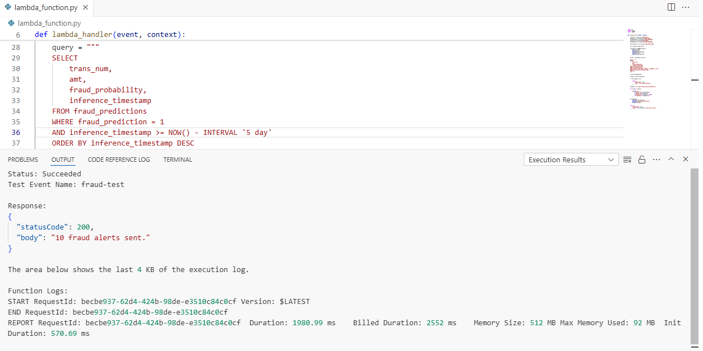
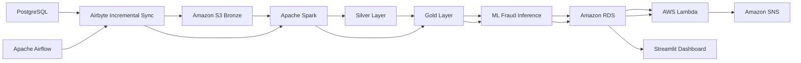

# End-to-End Fraud Detection Platform



A cloud-native end-to-end Fraud Detection Platform built using Apache Spark, Airflow, AWS, Airbyte, and Machine Learning to simulate a fraud analytics environment.

The project combines distributed data processing, incremental ingestion, automated orchestration, fraud inference, cloud alerting, and operational monitoring into a single scalable architecture.

---

# Full Project Documentation

The complete project documentation includes:

- End-to-end architecture
- Incremental ingestion workflows
- Distributed Spark processing
- Feature engineering
- ML inference pipeline
- AWS infrastructure
- Airflow orchestration
- Fraud alert automation
- Monitoring dashboard
- Demo videos and execution logs

## Visit Full Documentation

**[Open Complete Project Documentation](https://ferreiragabrielw.github.io/portfolio-gabriel/projetos/DataEngineering/2FraudDetection/FraudDetection.html)**

---

# Architecture Overview



---

# Main Technologies

| Layer | Technologies |
|---|---|
| Data Processing | Apache Spark |
| Orchestration | Apache Airflow |
| Ingestion | Airbyte |
| Storage | Amazon S3 |
| Database | PostgreSQL + Amazon RDS |
| Machine Learning | Scikit-learn |
| Monitoring | Streamlit |
| Alerting | AWS Lambda + SNS |
| Infrastructure | Docker + AWS |

---

# Platform Highlights

- Incremental ingestion architecture
- Replay-safe processing
- Distributed feature engineering
- Fraud inference pipeline
- Cloud-native alerting system
- Operational fraud monitoring dashboard
- End-to-end orchestration workflow
- Production-oriented architecture simulation

---

# Project Structure

```text
.
├── airbyte/
├── airflow/
├── configs/
├── dashboard/
├── data/
├── databse/
├── docker/
├── docs/
├── quarto/
├── scripts/
├── notebooks/
├── spark/
├── README.md
└── docker-compose.yml
```