# Introduction

Financial fraud has become one of the most critical challenges in modern digital ecosystems.  
As transaction volumes continue to grow across banking, fintech, and e-commerce platforms, organizations require scalable architectures capable of ingesting, processing, monitoring, and detecting suspicious behavior in near real-time.

This project was designed as an end-to-end cloud Fraud Detection Platform that simulates a production data engineering and machine learning environment using distributed processing, orchestration, incremental ingestion, automated alerting, and monitoring.

The platform combines Data Engineering and Machine Learning practices to create a complete fraud analytics ecosystem capable of:

- Ingesting real-world transactional fraud data
- Performing incremental ingestion pipelines
- Processing data using distributed Spark workloads
- Engineering fraud-oriented features
- Executing batch ML inference pipelines
- Persisting fraud predictions into cloud databases
- Triggering automated fraud alerts
- Delivering executive monitoring dashboards

This solution focuses on the complete operational lifecycle of fraud analytics in a cloud environment.

---

## Data Source

The foundation of the platform uses the publicly available fraud detection dataset from Kaggle:

- Sparkov Data Generation Dataset

The dataset contains realistic transactional patterns, customer behavior, merchant information, geolocation data, timestamps, and fraud labels that closely resemble real-world financial transaction scenarios.

To better simulate a continuously operating production environment, additional transaction generation and incremental ingestion logic were implemented on top of the original dataset, enabling:

- Incremental transaction arrival simulation
- Batch ingestion cycles
- Replay-safe processing
- Streaming-like fraud monitoring behavior

This approach allows the project to maintain realistic fraud patterns while also simulating modern production data engineering workflows.

---

## Key Highlights

- Sparkov fraud dataset integration
- Incremental ingestion architecture
- Distributed feature engineering
- ML inference orchestration
- Cloud-native alerting system
- Executive monitoring dashboard
- AWS-native infrastructure
- Replay-safe pipeline execution
- End-to-end orchestration with Apache Airflow
- Multi-layer Data Lake architecture (Bronze / Silver / Gold)

---

## Technology Stack

| Layer | Technologies |
|---|---|
| Dataset Source | Kaggle Sparkov Fraud Dataset |
| Data Batch Generation | Python |
| Source Database | PostgreSQL |
| Data Ingestion | Airbyte |
| Data Lake | Amazon S3 |
| Distributed Processing | Apache Spark |
| Orchestration | Apache Airflow |
| Machine Learning | Scikit-learn |
| Database Storage | Amazon RDS |
| Alerting | AWS Lambda + SNS |
| Monitoring Dashboard | Streamlit |
| Cloud Platform | AWS |
| Containerization | Docker |

---

# Architecture Overview

The architecture was designed following modern Data Engineering and MLOps principles, separating the platform into independent and scalable processing layers.

The pipeline starts with transactional fraud records from Kaggle Sparkov dataset stored inside PostgreSQL.  
Airbyte performs incremental ingestion into Amazon S3, where the Data Lake is organized into Bronze, Silver, and Gold layers.

Apache Spark processes and enriches the data through distributed transformations and feature engineering stages.  
The ML inference pipeline generates fraud predictions that are persisted into Amazon RDS.

Apache Airflow orchestrates the complete workflow, while AWS Lambda continuously monitors high-risk fraud predictions and dispatches real-time notifications through Amazon SNS.

Finally, a Streamlit dashboard provides operational and executive-level monitoring for fraud analytics and pipeline observability.

---

## Platform Architecture

```{mermaid}
graph TD

A[Sparkov Fraud Dataset]
--> B[PostgreSQL Transactional DB]

B --> C[Airbyte Incremental Sync]

C --> D[Amazon S3 Bronze Layer]

D --> E[Apache Spark Bronze → Silver Processing]

E --> F[Amazon S3 Silver Layer]

F --> G[Apache Spark Silver → Gold Feature Engineering]

G --> H[Amazon S3 Gold Layer]

H --> I[Machine Learning Fraud Inference]

I --> J[Amazon RDS Fraud Predictions]

J --> K[AWS Lambda Fraud Monitoring]

K --> L[Amazon SNS Email Alerts]

J --> M[Streamlit Executive Dashboard]

N[Apache Airflow Orchestration]
--> C
--> E
--> G
--> I
--> J
--> K

subgraph AWS Cloud
D
F
H
J
K
L
end

subgraph Distributed Processing
E
G
I
end

subgraph Monitoring Layer
M
L
end
```

---

## Architectural Design Principles

The platform was built using the following architectural principles:

- Idempotent Processing:

Only newly available transactions are processed during each pipeline execution, reducing computational cost and improving scalability.

- Replay-Safe Operations:

The ingestion and inference pipelines were designed to prevent duplicate records and ensure deterministic executions.

- Layered Data Lake Strategy:

The Data Lake follows a medallion architecture:

| Layer | Purpose |
|---|---|
| Bronze | Raw immutable ingestion |
| Silver | Cleansed and standardized data |
| Gold | ML-ready analytical features |


- Distributed Processing:

Apache Spark handles large-scale transformations and feature engineering operations using distributed computation.

- Modular Pipeline Design:

Each pipeline stage is isolated and independently executable, enabling easier maintenance and orchestration.

- Cloud Scalability:

AWS services were integrated to simulate production fraud monitoring workflows including:

#### Data Flow Summary

The complete platform workflow can be summarized as follows:

1. Fraud transaction records are loaded from dataset
2. PostgreSQL stores transactional source data
3. Airbyte incrementally ingests new records into Amazon S3
4. Spark transforms Bronze data into Silver standardized datasets
5. Additional fraud features are engineered in the Gold layer
6. The ML pipeline performs fraud inference
7. Predictions are stored inside Amazon RDS
8. AWS Lambda continuously monitors fraud probabilities
9. SNS dispatches real-time alert notifications
10. Streamlit exposes executive monitoring dashboards

---

# Infrastructure Overview

The infrastructure was separated into two main environments:

| Environment | Responsibility |
|---|---|
| Local Containerized Services | Development, orchestration, processing |
| AWS Cloud Services | Storage, monitoring, persistence, alerting |
<br>

##### Local Services

The following services were executed locally inside Docker containers:

| Service | Purpose |
|---|---|
| PostgreSQL | Source transactional database |
| Airbyte | Incremental Sync to S3 (Bronze)  |
| Apache Airflow | Workflow orchestration |
| PySpark Lab | Distributed Spark execution |
| JupyterLab | Development and validation environment |

---

##### Docker Compose Architecture:

- PostgreSQL container
- Airbyte container
- Spark container
- Airflow Webserver
- Airflow Scheduler

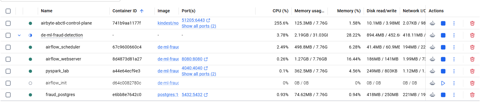

##### AWS Cloud Infrastructure

Cloud-native services were integrated into the platform to simulate production-grade data engineering and machine learning operations.

- **Amazon S3**:

Amazon S3 was used as the centralized Data Lake storage layer.

The storage architecture follows the Medallion Architecture approach:

| Layer | Purpose |
|---|---|
| Bronze | Raw immutable ingestion |
| Silver | Cleansed and transformed data |
| Gold | ML-ready analytical features |

---

- **S3 Data Lake Structure:**

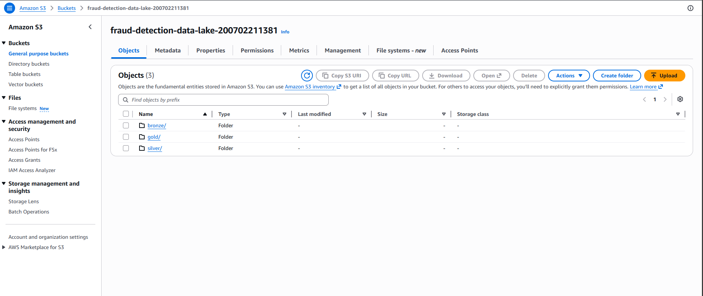

```text
s3://fraud-detection-data-lake/

├── bronze/
│   └── transactions/
│
├── silver/
│   └── transactions/
│
├── gold/
│   ├── fraud_features/
│   └── current_predictions_batch/
```
- **Amazon RDS**:

Amazon RDS (PostgreSQL) was used to persist fraud prediction results and inference outputs.

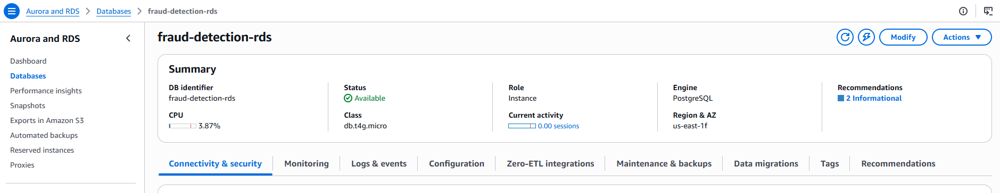

The database stores:

- Fraud predictions
- Fraud probabilities
- Engineered ML features
- Inference timestamps
- Operational monitoring data
 
 --- 

- **AWS Lambda:**

AWS Lambda was implemented to continuously monitor fraud predictions stored inside Amazon RDS.

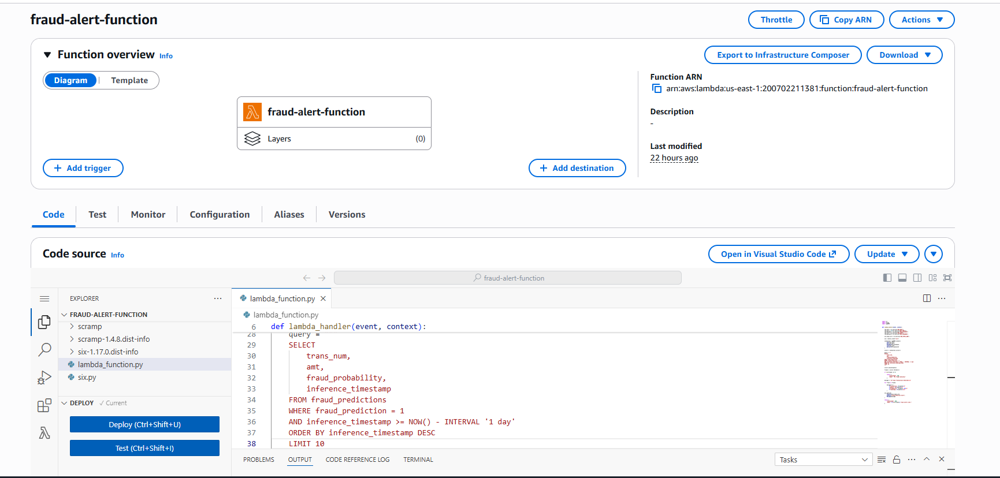

The Lambda function performs:

- Automated fraud querying
- Highrisk transaction filtering
- Alert generation
- SNS notification dispatching

---

- **Amazon SNS:**

Amazon SNS was integrated as the notification layer responsible for:

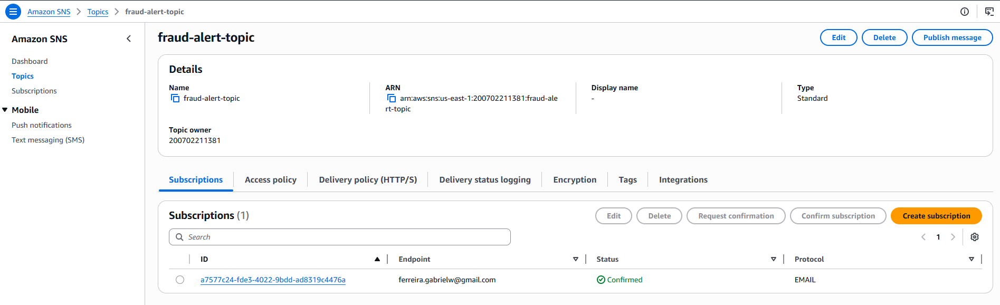

- Fraud alert emails
- Automated fraud notifications
- Event-driven monitoring communication

---

## Apache Airflow Infrastructure

Apache Airflow orchestrates the complete E2E platform execution.

The DAG coordinates:

1. Incremental ingestion
2. Bronze → Silver transformation
3. Silver → Gold feature engineering
4. ML inference
5. Prediction persistence
6. Fraud alert triggering

---

## Airflow Workflow

```{mermaid}
graph LR

A[Airbyte Incremental Sync]
--> B[Bronze to Silver]

B --> C[Silver to Gold]

C --> D[Fraud Inference]

D --> E[Write Predictions to RDS]

E --> F[Trigger Fraud Alert Lambda]
```

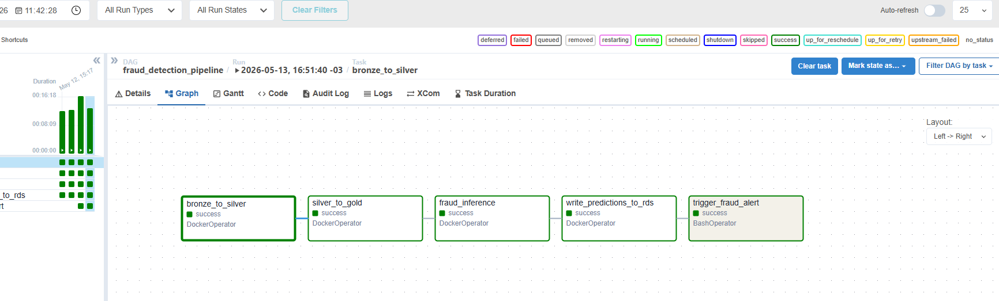

## Infrastructure Validation

The infrastructure was validated through multiple full pipeline executions including:

- Incremental ingestion cycles
- Distributed Spark processing
- Fraud prediction persistence
- Automated fraud alerting
- Dashboard updates
- Airflow orchestration runs

The final platform successfully processed more than 1.3 million fraud transaction records across the complete pipeline.

---

## Cloud Design Characteristics

The platform was intentionally designed following modern cloud engineering principles:

| Principle | Implementation |
|---|---|
| Scalability | Distributed Spark workloads |
| Decoupling | Independent processing layers |
| Automation | Airflow orchestration |
| Observability | Dashboard + SNS alerts |
| Modularity | Independent pipeline scripts |
| Reproducibility | Docker containers |
| Incremental Processing | Cursor based ingestion |
| Replay Safety | Duplicate prevention logic |

# Incremental Transaction Generation

To simulate a continuously operating production environment, instead of processing the full dataset repeatedly, the project simulates a production ingestion scenario by incrementally generating and inserting new transaction batches into PostgreSQL.

### Pipeline Execution

The following workflow was repeatedly executed during the project:

1. Generate new transaction batch
2. Insert records into PostgreSQL
3. Trigger Airbyte incremental sync
4. Execute Spark transformations
5. Perform ML inference
6. Persist predictions into Amazon RDS
7. Trigger fraud alert automation
8. Update monitoring dashboard

---

## PostgreSQL as Transactional Source

PostgreSQL acts as the operational source system for the platform.

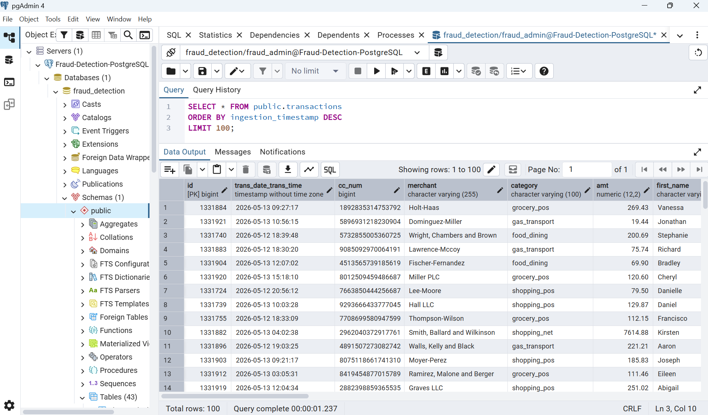

The database receives incremental transaction inserts and serves as the ingestion source consumed by Airbyte.

### Production Oriented Design

Although the platform operates in batch mode, the transaction generator was intentionally designed to emulate near real-time operational environments.

## Demo Video

The following demonstration shows the incremental transaction generation workflow used to simulate continuously arriving financial operations inside the platform.

The demo includes:

1. Incremental batch generation
2. New transaction creation
3. Batch insertion into PostgreSQL
4. Validation of newly inserted records
5. Production-like ingestion simulation

This execution demonstrates how the platform emulates a continuously operating transactional environment, enabling realistic incremental ingestion and fraud monitoring workflows.

<video width="100%" controls>
  <source src="01_generator_pg.mp4" type="video/mp4">
</video>

# Incremental Data Ingestion

After new transaction batches are inserted into PostgreSQL, the platform performs incremental ingestion using Airbyte.

This ingestion layer simulates how enterprise analytical platforms continuously transport operational data into cloud-native Data Lakes.

---

## Incremental Ingestion Strategy

The platform uses a timestamp-based cursor strategy to incrementally synchronize only newly inserted transactions.

This design enables:

- Incremental ingestion
- Reduced processing overhead
- Replay-safe synchronization
- Scalable ELT execution
- Production-like ingestion behavior

Instead of repeatedly ingesting the full transactional dataset, Airbyte captures only records created after the last successful synchronization.

##### Source Definition:

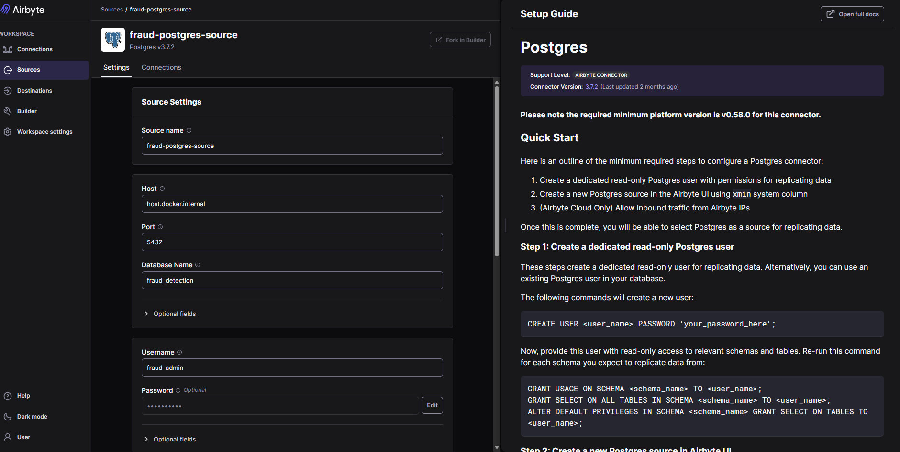

---

##### Destination Definition:

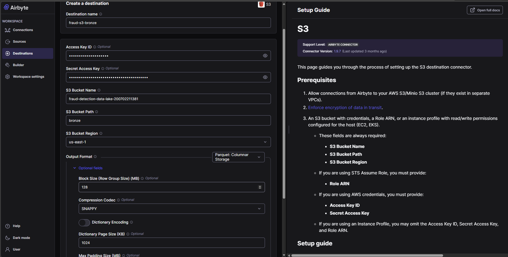


---

## Cursor-Based Synchronization

The ingestion workflow was configured using:

| Configuration | Strategy |
|---|---|
| Sync Mode | Incremental Append |
| Cursor Field | Transaction Timestamp |
| Destination | Amazon S3 |
| Replication Frequency | On-demand batch execution |

The timestamp cursor ensures deterministic ingestion behavior while preventing duplicated records during repeated pipeline executions.

---

## Incremental Ingestion Workflow

```{mermaid}
graph LR

A[PostgreSQL Transaction Source]
--> B[Airbyte Incremental Sync]

B --> C[Timestamp Cursor Validation]

C --> D[New Transactions Selected]

D --> E[Amazon S3 Bronze Layer]
```

---

## Airbyte Configuration

Airbyte was configured to continuously synchronize incremental transaction batches into the Amazon S3 Bronze Layer.

##### Ingestion Setup:

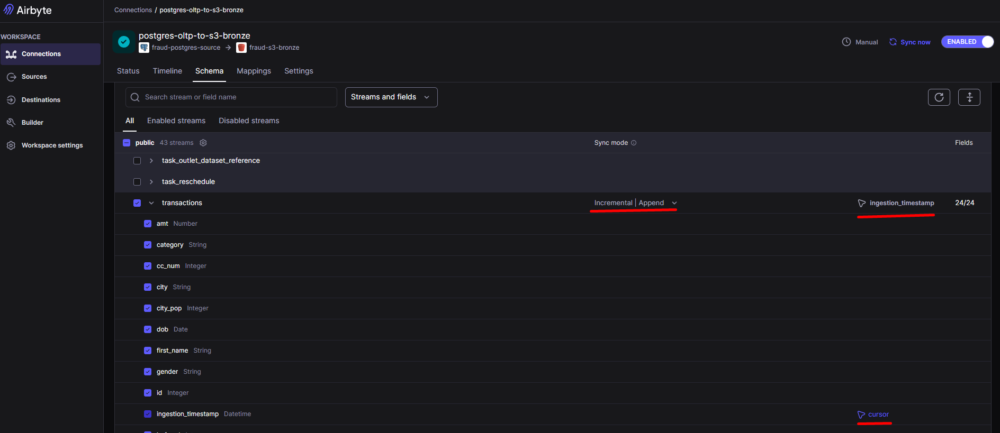

---

## Sync Validation

Multiple ingestion cycles were executed to validate the incremental behavior.

Example execution flow:

| Execution | New Transactions |
|---|---|
| Initial Full Sync | 1,321,675 |
| Incremental Sync 1 | 5,000 |
| Incremental Sync 2 | 5,000 |
| Incremental Sync 3 | 5,000 |

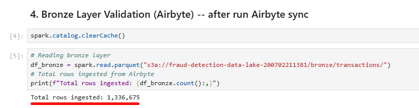


This validation confirmed:

- Correct cursor tracking
- Incremental synchronization
- Replay-safe ingestion
- Stable S3 persistence

---

## Demo Video

The following demonstration video shows the incremental ingestion workflow operating between PostgreSQL and Amazon S3 through Airbyte synchronization.

<video width="100%" controls>
  <source src="02_airbyte_sync.mp4" type="video/mp4">
</video>

This execution demonstrates how the platform continuously transports newly generated transaction batches into the cloud Data Lake architecture.

---

# Data Lake Architecture

The platform adopts a Medallion-style Data Lake architecture organized into Bronze, Silver, and Gold layers.

This layered design enables scalable processing, modular transformations, improved data quality, and ML-ready analytical workflows.

Amazon S3 was used as the centralized storage layer for all pipeline stages.

---

## Data Lake Strategy

The layered architecture separates the platform into independent processing stages:

| Layer | Responsibility |
|---|---|
| Bronze | Raw immutable ingestion |
| Silver | Standardized and cleansed data |
| Gold | ML-ready analytical features |

## Bronze Layer

The Bronze Layer stores raw transactional data ingested directly from Airbyte. This layer acts as the foundation of the entire platform.

---

#### Bronze Layer Responsibilities

The Bronze Layer is responsible for:

- Receiving incremental transaction batches
- Preserving original records
- Maintaining ingestion history
- Supporting downstream transformations

---

## Silver Layer

The Silver Layer standardizes and cleanses the raw transactional data. Apache Spark was used to process Bronze records into curated datasets suitable for analytical transformations.

---

#### Silver Layer Transformations

Main transformations include:

- Timestamp conversion
- Data standardization
- Temporal feature extraction
- Weekend identification
- Type casting
- Data normalization

---

#### Silver Processing Script

##### Script 01 — bronze_to_silver.py:

<details>
<summary><strong>See script</strong></summary>

```python
from pyspark.sql import SparkSession
from pyspark.sql.functions import *

import os
from dotenv import load_dotenv


# ============================================================
# LOADING ENVIRONMENT VARIABLES
# ============================================================

load_dotenv("/home/jovyan/work/.env")

AWS_ACCESS_KEY = os.getenv("AWS_ACCESS_KEY_ID")
AWS_SECRET_KEY = os.getenv("AWS_SECRET_ACCESS_KEY")
S3_BUCKET_NAME = os.getenv("S3_BUCKET_NAME")


# ============================================================
# SPARK SESSION
# ============================================================

spark = SparkSession.builder \
    .appName("FraudDetectionBronzeToSilver") \
    .config(
        "spark.jars",
        "/home/jovyan/work/jars/hadoop-aws-3.3.4.jar,"
        "/home/jovyan/work/jars/aws-java-sdk-bundle-1.12.262.jar"
    ) \
    .config(
        "spark.hadoop.fs.s3a.impl",
        "org.apache.hadoop.fs.s3a.S3AFileSystem"
    ) \
    .config(
        "spark.hadoop.fs.s3a.aws.credentials.provider",
        "org.apache.hadoop.fs.s3a.SimpleAWSCredentialsProvider"
    ) \
    .getOrCreate()


# ============================================================
# AWS CONFIGURATION
# ============================================================

spark._jsc.hadoopConfiguration().set(
    "fs.s3a.access.key",
    AWS_ACCESS_KEY
)

spark._jsc.hadoopConfiguration().set(
    "fs.s3a.secret.key",
    AWS_SECRET_KEY
)

spark._jsc.hadoopConfiguration().set(
    "fs.s3a.endpoint",
    "s3.amazonaws.com"
)


# ============================================================
# S3 PATHS
# ============================================================

BRONZE_PATH = (
    f"s3a://{S3_BUCKET_NAME}/"
    "bronze/transactions/"
)

SILVER_PATH = (
    f"s3a://{S3_BUCKET_NAME}/"
    "silver/transactions/"
)


# ============================================================
# READING BRONZE LAYER
# ============================================================

print("Reading Bronze layer from S3...")

df_bronze = spark.read.parquet(BRONZE_PATH)

print(f"Bronze rows loaded: {df_bronze.count():,}")


# ============================================================
# DATA STANDARDIZATION
# ============================================================

print("Applying Silver transformations...")


df_silver = (

    df_bronze

    # Converting transaction timestamp
    .withColumn(
        "trans_date_trans_time",
        to_timestamp("trans_date_trans_time")
    )

    # Creating temporal features
    .withColumn(
        "transaction_year",
        year("trans_date_trans_time")
    )

    .withColumn(
        "transaction_month",
        month("trans_date_trans_time")
    )

    .withColumn(
        "transaction_day",
        dayofmonth("trans_date_trans_time")
    )

    .withColumn(
        "transaction_hour",
        hour("trans_date_trans_time")
    )

    # Weekend transaction flag
    .withColumn(
        "is_weekend",
        when(
            dayofweek("trans_date_trans_time").isin([1, 7]),
            1
        ).otherwise(0)
    )

    # Standardizing amount type
    .withColumn(
        "amt",
        col("amt").cast("double")
    )

)


print(
    f"Silver rows after transformation: "
    f"{df_silver.count():,}"
)


# ============================================================
# WRITING SILVER LAYER
# ============================================================

print("Writing Silver layer into S3...")


df_silver.write \
    .mode("overwrite") \
    .partitionBy(
        "transaction_year",
        "transaction_month"
    ) \
    .parquet(SILVER_PATH)


print("Silver layer successfully updated.")


# ============================================================
# STOPPING SPARK SESSION
# ============================================================

spark.stop()

print("Bronze to Silver pipeline completed.")
```

</details>

This Spark pipeline performs:

- Bronze ingestion
- Timestamp parsing
- Transaction standardization
- Temporal enrichment
- Silver persistence

---

## Gold Layer

The Gold Layer contains ML-ready fraud analytical features generated through distributed Spark transformations.

This layer is optimized for Machine Learning inference and fraud monitoring workflows.

---

#### Gold Layer Objectives

The Gold Layer prepares the dataset for:

- Fraud inference
- Behavioral analytics
- Fraud scoring
- Monitoring dashboards
- Operational analytics

#### Gold Processing Script

##### Script 02 — silver_to_gold.py:

<details>
<summary><strong>See script</strong></summary>

```python
from pyspark.sql import SparkSession
from pyspark.sql.functions import *

import os
from dotenv import load_dotenv


# ============================================================
# LOADING ENVIRONMENT VARIABLES
# ============================================================

load_dotenv()

AWS_ACCESS_KEY = os.getenv("AWS_ACCESS_KEY_ID")
AWS_SECRET_KEY = os.getenv("AWS_SECRET_ACCESS_KEY")
S3_BUCKET_NAME = os.getenv("S3_BUCKET_NAME")


# ============================================================
# SPARK SESSION
# ============================================================

spark = SparkSession.builder \
    .appName("FraudDetectionSilverToGold") \
    .config(
        "spark.jars",
        "/home/jovyan/work/jars/hadoop-aws-3.3.4.jar,"
        "/home/jovyan/work/jars/aws-java-sdk-bundle-1.12.262.jar"
    ) \
    .config(
        "spark.hadoop.fs.s3a.impl",
        "org.apache.hadoop.fs.s3a.S3AFileSystem"
    ) \
    .config(
        "spark.hadoop.fs.s3a.aws.credentials.provider",
        "org.apache.hadoop.fs.s3a.SimpleAWSCredentialsProvider"
    ) \
    .getOrCreate()


# ============================================================
# AWS CONFIGURATION
# ============================================================

spark._jsc.hadoopConfiguration().set(
    "fs.s3a.access.key",
    AWS_ACCESS_KEY
)

spark._jsc.hadoopConfiguration().set(
    "fs.s3a.secret.key",
    AWS_SECRET_KEY
)

spark._jsc.hadoopConfiguration().set(
    "fs.s3a.endpoint",
    "s3.amazonaws.com"
)


# ============================================================
# S3 PATHS
# ============================================================

SILVER_PATH = (
    f"s3a://{S3_BUCKET_NAME}/"
    "silver/transactions/"
)

GOLD_PATH = (
    f"s3a://{S3_BUCKET_NAME}/"
    "gold/fraud_features/"
)


# ============================================================
# READING SILVER LAYER
# ============================================================

print("Reading Silver layer from S3...")

df_silver = spark.read.parquet(SILVER_PATH)

print(f"Silver rows loaded: {df_silver.count():,}")


# ============================================================
# GOLD FEATURE ENGINEERING
# ============================================================

print("Applying Gold feature engineering...")


df_gold = (

    df_silver

    # Customer age
    .withColumn(
        "customer_age",
        floor(
            datediff(
                current_date(),
                col("dob")
            ) / 365
        )
    )

    # High transaction amount
    .withColumn(
        "high_amount_flag",
        when(col("amt") > 500, 1).otherwise(0)
    )

    # Night transaction flag
    .withColumn(
        "night_transaction_flag",
        when(
            col("transaction_hour").between(0, 5),
            1
        ).otherwise(0)
    )

    # Geographic distance approximation
    .withColumn(
        "customer_merchant_distance",
        sqrt(
            pow(col("lat") - col("merch_lat"), 2) +
            pow(col("long") - col("merch_long"), 2)
        )
    )

)


print(f"Gold rows generated: {df_gold.count():,}")


# ============================================================
# WRITING GOLD LAYER
# ============================================================

print("Writing Gold layer into S3...")


df_gold.write \
    .mode("overwrite") \
    .partitionBy(
        "transaction_year",
        "transaction_month"
    ) \
    .parquet(GOLD_PATH)


print("Gold layer successfully updated.")


# ============================================================
# STOPPING SPARK SESSION
# ============================================================

spark.stop()

print("Silver to Gold pipeline completed.")
```

</details>

This Spark pipeline performs:

- Fraud feature engineering
- Behavioral enrichment
- Distance calculations
- ML-ready transformation
- Gold persistence

---

## ML Features Created

| Feature | Description |
|---|---|
| customer_age | Customer age calculation |
| high_amount_flag | High-value transaction indicator |
| night_transaction_flag | Night transaction detection |
| customer_merchant_distance | Geographic anomaly approximation |
| transaction_hour | Transaction temporal behavior |
| is_weekend | Weekend transaction behavior |

---

# Distributed Processing with Apache Spark

Apache Spark was used as the distributed processing engine responsible for transforming, enriching, and preparing transactional fraud data across the Silver and Gold layers.

The platform leverages Spark to simulate large-scale enterprise data processing workflows commonly found in financial fraud analytics environments.

Spark was selected because it enables:

- Distributed computation
- Large-scale transformations
- Parallel feature engineering
- Scalable cloud integration
- Efficient Parquet processing
- High-volume analytical workloads

Instead of processing data locally, Spark distributes transformations across multiple executors, allowing the platform to efficiently process millions of transactional records.

**Spark Log after first script:**
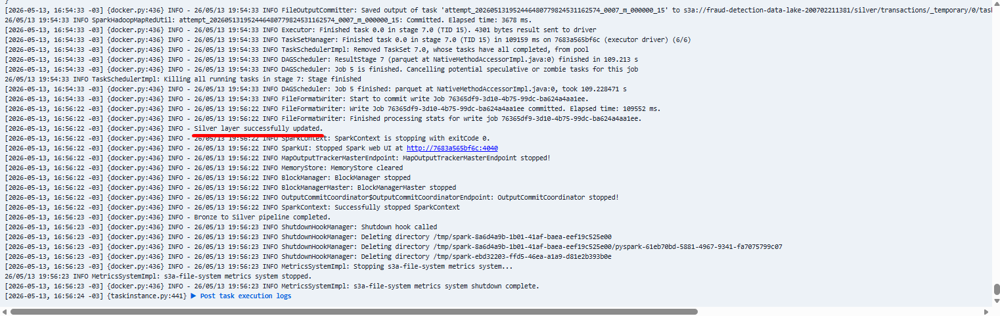

Spark was responsible for:

- Large-scale transformations
- Distributed feature engineering
- S3 integration
- Partitioned Parquet persistence
- Incremental processing support

**Spark Log after second script:**
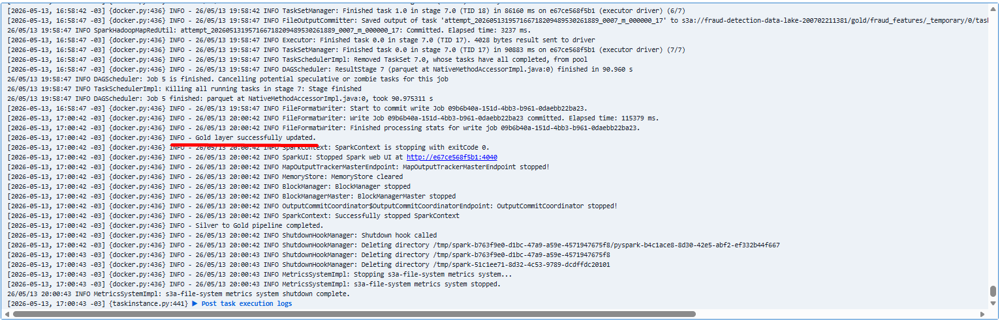

---

## Partitioning Strategy

The platform partitions Silver and Gold datasets using:

| Partition | Purpose |
|---|---|
| transaction_year | Temporal partitioning |
| transaction_month | Incremental organization |

This improves query performance, storage organization, incremental processing and analytical scalability

---

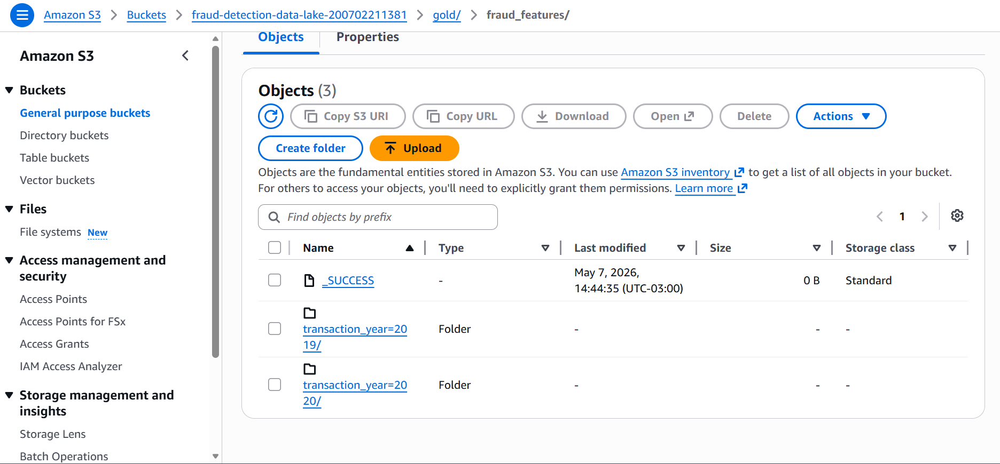

The layered Data Lake architecture was validated through multiple incremental processing cycles.

# Fraud Detection Model Development

After the Gold Layer feature engineering stage, a Machine Learning model was trained to identify potentially fraudulent financial transactions.

The primary objective of this stage was not to build a highly optimized research-oriented fraud model, but rather to support the complete end-to-end fraud analytics platform and demonstrate how Machine Learning integrates into modern Data Engineering and MLOps workflows.

---

## Model Development Strategy

The fraud detection problem was treated as a supervised binary classification task.

The model receives transactional and behavioral features engineered during the Gold Layer processing stage and predicts whether a transaction should be classified as fraudulent.

---

## Dataset Preparation

The preparation workflow included:

- Feature selection
- Null handling
- Label extraction
- Train/test split
- Numerical preprocessing

---

## Model Training Notebook

The following notebook contains the model development workflow used during the project.

```{=html}
<iframe
    src="02_fraud_detection_ml.html"
    width="100%"
    height="900px"
    style="border:none;">
</iframe>
```

---

## Model Serialization

After training, the model was serialized and persisted for downstream inference execution.

The serialized model is later loaded by the fraud inference pipeline responsible for incremental fraud scoring.

---

# Fraud Inference Pipeline

After the model training stage, the platform executes the fraud inference pipeline responsible for generating fraud predictions and fraud probabilities for newly available transactions.

The inference architecture was intentionally designed to simulate production-oriented Machine Learning operational workflows.

## Inference Pipeline Objectives

The inference layer is responsible for:

- Loading the trained ML model
- Selecting ML-ready features
- Performing fraud prediction
- Generating fraud probabilities
- Persisting inference outputs
- Supporting automated alerting

The fraud inference pipeline applies incremental logic to avoid rescoring already processed transactions.

Instead of repeatedly processing the entire Gold dataset, the platform:

1. Reads the Gold Layer
2. Queries existing predictions stored inside Amazon RDS
3. Identifies transactions not previously scored
4. Executes inference only for new transactions

This strategy enables replay-safe inference, reduced computational overhead, scalable ML execution and incremental fraud monitoring.

---

## Fraud Inference Workflow

```{mermaid}
graph LR

A[Gold Layer]
--> B[Existing Prediction Validation]

B --> C[New Transactions Selected]

C --> D[Feature Selection]

D --> E[ML Model Inference]

E --> F[Fraud Predictions Generated]

F --> G[Current Prediction Batch]
```

---

## Feature Selection

The inference pipeline selects ML-ready fraud analytical features generated during the Gold transformation stage.

### Main Features Used

| Feature | Purpose |
|---|---|
| amt | Transaction amount |
| city_pop | Customer city population |
| transaction_hour | Temporal fraud behavior |
| is_weekend | Weekend transaction pattern |
| customer_age | Customer behavior profiling |
| high_amount_flag | High-risk transaction detection |
| night_transaction_flag | Night fraud behavior |
| customer_merchant_distance | Geographic anomaly approximation |

---

## Batch Inference Architecture

The platform performs batch-oriented inference using Pandas and Scikit-learn after distributed feature preparation in Spark.

The workflow includes:

1. Spark distributed processing
2. Feature extraction
3. Pandas conversion
4. ML inference execution
5. Prediction persistence

This architecture simplifies ML execution while maintaining distributed upstream processing.

---

## Fraud Prediction Outputs

The inference pipeline generates:

| Output | Description |
|---|---|
| fraud_prediction | Binary fraud classification |
| fraud_probability | Fraud probability score |
| inference_timestamp | Prediction execution timestamp |

<br>

These outputs are later persisted into Amazon RDS for monitoring and alerting.

## Append-Safe Architecture

The inference layer was intentionally designed to support append-safe prediction persistence.

The platform ensures no duplicate scoring, incremental prediction generation, replay-safe executionand deterministic inference behavior.

---

## Fraud Inference Process

The following script performs:

- Gold layer ingestion
- Existing prediction validation
- Incremental transaction filtering
- Feature selection
- ML inference execution
- Fraud probability generation
- Current prediction batch persistence

<details>
<summary><strong>See Script 03 — fraud_inference.py</strong></summary>

```python
from pyspark.sql import SparkSession
from pyspark.sql.functions import *

import pandas as pd
import joblib

from sqlalchemy import create_engine

import os
from dotenv import load_dotenv


# ============================================================
# LOADING ENVIRONMENT VARIABLES
# ============================================================

load_dotenv("/home/jovyan/work/.env")

AWS_ACCESS_KEY = os.getenv("AWS_ACCESS_KEY_ID")
AWS_SECRET_KEY = os.getenv("AWS_SECRET_ACCESS_KEY")
S3_BUCKET_NAME = os.getenv("S3_BUCKET_NAME")

RDS_HOST = os.getenv("RDS_HOST")
RDS_PORT = os.getenv("RDS_PORT")
RDS_DATABASE = os.getenv("RDS_DATABASE")
RDS_USER = os.getenv("RDS_USER")
RDS_PASSWORD = os.getenv("RDS_PASSWORD")


# ============================================================
# SPARK SESSION
# ============================================================

spark = SparkSession.builder \
    .appName("FraudDetectionInference") \
    .config(
        "spark.jars",
        "/home/jovyan/work/jars/hadoop-aws-3.3.4.jar,"
        "/home/jovyan/work/jars/aws-java-sdk-bundle-1.12.262.jar"
    ) \
    .config(
        "spark.hadoop.fs.s3a.impl",
        "org.apache.hadoop.fs.s3a.S3AFileSystem"
    ) \
    .config(
        "spark.hadoop.fs.s3a.aws.credentials.provider",
        "org.apache.hadoop.fs.s3a.SimpleAWSCredentialsProvider"
    ) \
    .config(
        "spark.executor.heartbeatInterval",
        "60s"
    ) \
    .config(
        "spark.network.timeout",
        "300s"
    ) \
    .getOrCreate()


# ============================================================
# AWS CONFIGURATION
# ============================================================

spark._jsc.hadoopConfiguration().set(
    "fs.s3a.access.key",
    AWS_ACCESS_KEY
)

spark._jsc.hadoopConfiguration().set(
    "fs.s3a.secret.key",
    AWS_SECRET_KEY
)

spark._jsc.hadoopConfiguration().set(
    "fs.s3a.endpoint",
    "s3.amazonaws.com"
)


# ============================================================
# PATHS
# ============================================================

GOLD_PATH = (
    f"s3a://{S3_BUCKET_NAME}/"
    "gold/fraud_features/"
)

CURRENT_BATCH_PATH = (
    f"s3a://{S3_BUCKET_NAME}/"
    "gold/current_predictions_batch/"
)

MODEL_PATH = (
    "/home/jovyan/work/models/"
    "fraud_detection_model.pkl"
)


# ============================================================
# READING GOLD DATASET
# ============================================================

print("Reading Gold layer from S3...")

df_gold = spark.read.parquet(GOLD_PATH)

print(
    f"Gold rows available: "
    f"{df_gold.count():,}"
)


# ============================================================
# CONNECTING TO RDS
# ============================================================

print("Connecting to Amazon RDS...")

engine = create_engine(

    f"postgresql+psycopg2://{RDS_USER}:"
    f"{RDS_PASSWORD}@"
    f"{RDS_HOST}:{RDS_PORT}/"
    f"{RDS_DATABASE}"

)

print("RDS connection established.")


# ============================================================
# READING EXISTING PREDICTIONS FROM RDS
# ============================================================

print("Checking existing predictions in RDS...")

query = """
SELECT trans_num
FROM fraud_predictions
"""


try:

    existing_predictions = pd.read_sql(
        query,
        engine
    )

    existing_count = len(existing_predictions)

    print(
        f"Existing predictions found: "
        f"{existing_count:,}"
    )

    df_existing_predictions = spark.createDataFrame(
        existing_predictions
    )

except Exception:

    print(
        "No previous predictions found."
    )

    df_existing_predictions = None


# ============================================================
# FILTERING ONLY NEW TRANSACTIONS
# ============================================================

print(
    "Filtering transactions without predictions..."
)

if df_existing_predictions is not None:

    df_new_transactions = (

        df_gold.alias("gold")

        .join(

            df_existing_predictions.alias(
                "predictions"
            ),

            on="trans_num",

            how="left_anti"

        )

    )

else:

    df_new_transactions = df_gold


# ============================================================
# BATCH PROCESSING
# ============================================================

BATCH_SIZE = 5000


df_new_transactions = (

    df_new_transactions

    .orderBy(
        col("ingestion_timestamp").asc()
    )

    .limit(BATCH_SIZE)

)


new_rows = df_new_transactions.count()

print(
    f"New transactions selected: "
    f"{new_rows:,}"
)


# ============================================================
# EXIT IF NO NEW DATA
# ============================================================

if new_rows == 0:

    print(
        "No new transactions to infer."
    )

    spark.stop()

    exit()


# ============================================================
# SELECTING FEATURES
# ============================================================

selected_columns = [

    "trans_num",

    "amt",
    "city_pop",
    "lat",
    "long",
    "merch_lat",
    "merch_long",
    "unix_time",
    "transaction_hour",
    "is_weekend",
    "customer_age",
    "high_amount_flag",
    "night_transaction_flag",
    "customer_merchant_distance"

]


df_features = df_new_transactions.select(
    selected_columns
)

print("Feature selection completed.")


# ============================================================
# CONVERTING TO PANDAS
# ============================================================

print("Converting Spark DataFrame to Pandas...")

pdf_features = df_features.toPandas()

print("Conversion completed.")


# ============================================================
# MODEL INPUT DATASET
# ============================================================

model_features = pdf_features.drop(
    columns=["trans_num"]
)


# ============================================================
# LOADING TRAINED MODEL
# ============================================================

print("Loading trained model...")

model = joblib.load(MODEL_PATH)

print("Model successfully loaded.")


# ============================================================
# GENERATING PREDICTIONS
# ============================================================

print("Generating fraud predictions...")

predictions = model.predict(
    model_features
)

probabilities = model.predict_proba(
    model_features
)[:, 1]

print("Inference completed.")


# ============================================================
# BUILDING PREDICTION DATASET
# ============================================================

pdf_result = pdf_features.copy()

pdf_result["fraud_prediction"] = predictions

pdf_result["fraud_probability"] = probabilities

pdf_result["inference_timestamp"] = (
    pd.Timestamp.now()
)


# ============================================================
# CONVERTING BACK TO SPARK
# ============================================================

print(
    "Converting prediction dataset back to Spark..."
)

df_predictions = spark.createDataFrame(
    pdf_result
)

print(
    "Spark DataFrame successfully created."
)


# ============================================================
# WRITING CURRENT BATCH
# ============================================================

print("Writing current prediction batch into S3...")


df_predictions.write \
    .mode("overwrite") \
    .parquet(CURRENT_BATCH_PATH)


print(
    "Current prediction batch successfully saved."
)


# ============================================================
# STOPPING SPARK SESSION
# ============================================================

spark.stop()

print(
    "Fraud inference pipeline completed."
)
```

</details>

---

## Incremental Scoring Validation

The following execution demonstrates the incremental fraud scoring workflow:

```text
Gold rows available: 1,321,675
Existing predictions found: 1,316,675
New transactions selected: 5,000
Inference completed.
```
**Log after script run:**
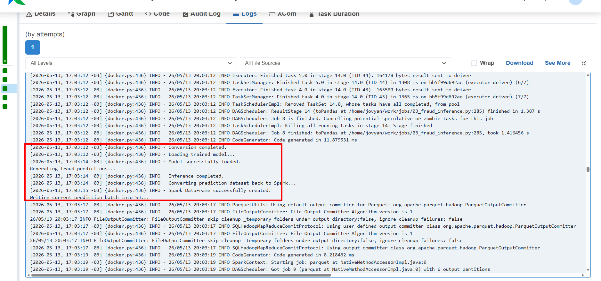

This execution validates incremental scoring logic, replay-safe inference, large-scale fraud processing, end-to-end orchestration consistency.

# Storage Layer (Amazon RDS)

After the fraud inference pipeline generates predictions and fraud probability scores, the results are persisted into Amazon RDS, which acts as the centralized operational repository for the platform.

This persistence layer became a critical component of the architecture because it allows the project to simulate how real fraud analytics environments continuously accumulate prediction results for monitoring, alerting, and operational consumption.

Instead of treating inference as a temporary process that only returns predictions in memory, the platform was intentionally designed to store all generated fraud outputs inside a persistent analytical database. This enables the downstream layers, such as the monitoring dashboard and the automated alerting system to operate independently from the inference execution itself.

The prediction persistence workflow stores both transactional information and ML-generated outputs, including fraud classifications, fraud probability scores, and inference timestamps.

## Prediction Workflow

```{mermaid}
graph LR

A[Fraud Inference Pipeline]
--> B[Current Prediction Batch]

B --> C[Amazon RDS]

C --> D[Monitoring Dashboard]

C --> E[AWS Lambda Fraud Alerts]
```

---

This design guarantees replay-safe behavior and prevents duplicated fraud predictions during repeated pipeline executions.

The final `fraud_predictions` table stores both engineered features and ML outputs, allowing the monitoring layer to consume enriched fraud analytical information directly from Amazon RDS.

---

## fraud_predictions Table

The persistence layer stores the following operational fraud attributes:

| Column | Description |
|---|---|
| trans_num | Unique transaction identifier |
| amt | Transaction amount |
| city_pop | Customer city population |
| lat | Customer latitude |
| long | Customer longitude |
| merch_lat | Merchant latitude |
| merch_long | Merchant longitude |
| unix_time | Transaction Unix timestamp |
| transaction_hour | Transaction hour |
| is_weekend | Weekend transaction flag |
| customer_age | Customer age |
| high_amount_flag | High-value transaction indicator |
| night_transaction_flag | Night transaction flag |
| customer_merchant_distance | Geographic anomaly approximation |
| fraud_prediction | Binary fraud classification |
| fraud_probability | Fraud probability score |
| inference_timestamp | Prediction execution timestamp |

---

One of the most important validations during the project involved confirming that the append-safe persistence logic was operating correctly. After several incremental ingestion and inference cycles, SQL validation queries were executed to ensure that the total number of stored transactions matched the number of unique transaction identifiers.

This validation confirmed that the persistence layer was correctly preventing duplicate inserts even after multiple orchestration runs.

Validation query:

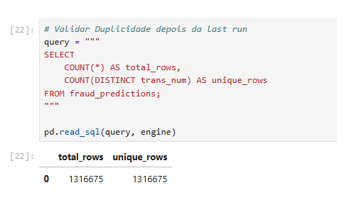

---

The persistence workflow was also intentionally integrated with the operational monitoring components of the platform.

Once predictions are stored inside Amazon RDS:

- The Streamlit dashboard immediately exposes updated fraud analytics
- AWS Lambda can continuously monitor high-risk fraud scores
- Amazon SNS can dispatch fraud alerts automatically
- Historical fraud monitoring becomes possible

---

## Writing Predicitons into RDS

The following script is responsible for:

- Reading the current prediction batch
- Connecting to Amazon RDS
- Persisting fraud predictions
- Appending only newly generated records

<details>
<summary><strong>See Script 4 write_predictions_to_rds.py</strong></summary>

```python
from pyspark.sql import SparkSession

import pandas as pd

from sqlalchemy import create_engine

import os
from dotenv import load_dotenv


# ============================================================
# LOADING ENVIRONMENT VARIABLES
# ============================================================

load_dotenv("/home/jovyan/work/.env")

AWS_ACCESS_KEY = os.getenv("AWS_ACCESS_KEY_ID")
AWS_SECRET_KEY = os.getenv("AWS_SECRET_ACCESS_KEY")
S3_BUCKET_NAME = os.getenv("S3_BUCKET_NAME")

RDS_HOST = os.getenv("RDS_HOST")
RDS_PORT = os.getenv("RDS_PORT")
RDS_DATABASE = os.getenv("RDS_DATABASE")
RDS_USER = os.getenv("RDS_USER")
RDS_PASSWORD = os.getenv("RDS_PASSWORD")


# ============================================================
# SPARK SESSION
# ============================================================

spark = SparkSession.builder \
    .appName("WritePredictionsToRDS") \
    .config(
        "spark.jars",
        "/home/jovyan/work/jars/hadoop-aws-3.3.4.jar,"
        "/home/jovyan/work/jars/aws-java-sdk-bundle-1.12.262.jar"
    ) \
    .config(
        "spark.hadoop.fs.s3a.impl",
        "org.apache.hadoop.fs.s3a.S3AFileSystem"
    ) \
    .config(
        "spark.hadoop.fs.s3a.aws.credentials.provider",
        "org.apache.hadoop.fs.s3a.SimpleAWSCredentialsProvider"
    ) \
    .config(
        "spark.executor.heartbeatInterval",
        "60s"
    ) \
    .config(
        "spark.network.timeout",
        "300s"
    ) \
    .getOrCreate()


# ============================================================
# AWS CONFIGURATION
# ============================================================

spark._jsc.hadoopConfiguration().set(
    "fs.s3a.access.key",
    AWS_ACCESS_KEY
)

spark._jsc.hadoopConfiguration().set(
    "fs.s3a.secret.key",
    AWS_SECRET_KEY
)

spark._jsc.hadoopConfiguration().set(
    "fs.s3a.endpoint",
    "s3.amazonaws.com"
)


# ============================================================
# S3 PATH
# ============================================================

CURRENT_BATCH_PATH = (
    f"s3a://{S3_BUCKET_NAME}/"
    "gold/current_predictions_batch/"
)


# ============================================================
# READING CURRENT BATCH
# ============================================================

print("Reading current prediction batch from S3...")

df_predictions = spark.read.parquet(
    CURRENT_BATCH_PATH
)

batch_rows = df_predictions.count()

print(
    f"Prediction batch rows loaded: "
    f"{batch_rows:,}"
)


# ============================================================
# EXIT IF NO DATA
# ============================================================

if batch_rows == 0:

    print(
        "No prediction batch found."
    )

    spark.stop()

    exit()


# ============================================================
# CONVERTING TO PANDAS
# ============================================================

print("Converting Spark DataFrame to Pandas...")

pdf_predictions = df_predictions.toPandas()

print("Conversion completed.")


# ============================================================
# RDS CONNECTION
# ============================================================

print("Connecting to Amazon RDS...")


engine = create_engine(

    f"postgresql+psycopg2://{RDS_USER}:"
    f"{RDS_PASSWORD}@"
    f"{RDS_HOST}:{RDS_PORT}/"
    f"{RDS_DATABASE}"

)

print("RDS connection established.")


# ============================================================
# WRITING BATCH INTO RDS
# ============================================================

print("Writing prediction batch into RDS...")


pdf_predictions.to_sql(
    name="fraud_predictions",
    con=engine,
    if_exists="append",
    index=False,
    method="multi",
    chunksize=5000
)


print(
    "Prediction batch successfully written into RDS."
)


# ============================================================
# STOPPING SPARK SESSION
# ============================================================

spark.stop()

print(
    "write_predictions_to_rds pipeline completed."
)
```

</details>

---

## RDS Final Table

::: {.table-responsive}

| trans_num | amt | city_pop | lat | long | merch_lat | merch_long | unix_time | transaction_hour | is_weekend | customer_age | high_amount_flag | night_transaction_flag | customer_merchant_distance | fraud_prediction | fraud_probability | inference_timestamp |
|---|---:|---:|---:|---:|---:|---:|---:|---:|---:|---:|---:|---:|---:|---:|---:|---|
| 7609599b... | 259.23 | 116990 | 35.648352 | -81.293576 | 35.642961 | -81.328790 | 1778700801 | 16 | 0 | 18 | 0 | 0 | 0.035624 | 0 | 0.001331 | 2026-05-13 20:03:14.972671 |
| fec3c38b... | 299.77 | 974783 | 35.336268 | -89.218425 | 35.321683 | -89.263368 | 1778666940 | 7 | 0 | 76 | 0 | 0 | 0.047250 | 0 | 0.007467 | 2026-05-13 20:03:14.972671 |
| fb02a824... | 263.33 | 284320 | 30.892875 | -94.582859 | 30.905323 | -94.578914 | 1778622332 | 18 | 0 | 36 | 0 | 0 | 0.013058 | 0 | 0.001603 | 2026-05-13 20:03:14.972671 |
| fb93b2d2... | 128.82 | 4547 | 36.286214 | -82.499280 | 36.242350 | -82.503554 | 1778650872 | 2 | 0 | 71 | 0 | 1 | 0.044072 | 0 | 0.001622 | 2026-05-13 20:03:14.972671 |
| fdda06f0... | 71.92 | 771750 | 37.642593 | -86.040738 | 37.672605 | -86.069031 | 1778667080 | 7 | 0 | 23 | 0 | 0 | 0.041246 | 0 | 0.000288 | 2026-05-13 20:03:14.972671 |
| 8a35cf20... | 46.95 | 45288 | 36.236825 | -85.231244 | 36.257197 | -85.201960 | 1778628594 | 20 | 0 | 64 | 0 | 0 | 0.035673 | 0 | 0.000331 | 2026-05-13 20:03:14.972671 |
| fad57f5e... | 31.99 | 244816 | 39.944753 | -78.655733 | 39.922838 | -78.606837 | 1778637153 | 22 | 0 | 51 | 0 | 0 | 0.053583 | 0 | 0.002965 | 2026-05-13 20:03:14.972671 |
| 89c64bb8... | 155.55 | 649728 | 37.797859 | -74.447809 | 37.810607 | -74.491782 | 1778651092 | 2 | 0 | 33 | 0 | 1 | 0.045784 | 0 | 0.001453 | 2026-05-13 20:03:14.972671 |
| fb57cbc8... | 119.42 | 561041 | 34.191304 | -76.696008 | 34.197400 | -76.723568 | 1778661299 | 5 | 0 | 67 | 0 | 1 | 0.028226 | 0 | 0.000241 | 2026-05-13 20:03:14.972671 |
| 89d0244b... | 18.81 | 907825 | 30.574312 | -84.313331 | 30.594959 | -84.289883 | 1778651358 | 2 | 0 | 68 | 0 | 1 | 0.031243 | 0 | 0.009733 | 2026-05-13 20:03:14.972671 |

:::

<br>

The table below shows a sample of the final fraud prediction records persisted inside Amazon RDS after the inference pipeline execution.  
These records contain both engineered analytical features and Machine Learning outputs, enabling downstream monitoring, fraud alerting, and operational analytics workflows.

---

# AWS Lambda Fraud Alerting System

After fraud predictions are persisted into the operational storage layer, the platform automatically activates the fraud monitoring and alerting workflow using AWS Lambda and Amazon SNS.

This stage represents one of the most important components of the project because it transforms the platform from a passive fraud analytics pipeline into an active fraud monitoring system capable of generating automated operational alerts.

Instead of simply storing fraud predictions for later analysis, the architecture continuously evaluates newly generated fraud scores and automatically triggers notifications whenever suspicious transactions are identified.

This design closely resembles real fraud detection environments commonly found in banking, fintech, and payment processing platforms.

---

## Fraud Alerting Workflow

```{mermaid}
graph LR

A[Amazon RDS Fraud Predictions]
--> B[AWS Lambda Fraud Monitoring]

B --> C[High-Risk Fraud Detection]

C --> D[Amazon SNS Notifications]

D --> E[Fraud Alert Email]
```

---

The Lambda function continuously queries the `fraud_predictions` table stored inside Amazon RDS and evaluates newly generated fraud probability scores.

Transactions classified as high-risk are automatically selected and formatted into operational fraud alerts.

This architecture enables the platform to simulate a real-time operational fraud monitoring environment.

## Fraud Detection Logic

The Lambda function was configured to identify transactions with elevated fraud probability scores generated during the inference pipeline.

The monitoring logic evaluates:

- Fraud classification output
- Fraud probability threshold
- Newly generated prediction batches
- Recent inference timestamps

Only transactions meeting the alert criteria are included in the notification workflow.

## AWS Lambda Architecture

AWS Lambda was selected because it enables serverless event-driven monitoring without requiring dedicated infrastructure management.

This architecture provides several advantages:

The Lambda function operates independently from the inference pipeline itself, improving modularity and operational separation across the platform.

## Lambda Function

The Lambda function performs:

- Amazon RDS connection
- Fraud prediction querying
- High-risk transaction filtering
- Fraud alert generation
- SNS notification publishing

---

### fraud_alert_function.py

<details>
<summary><strong>See Lambda Code</strong></summary>

```python
import os
import boto3
import pg8000


def lambda_handler(event, context):

    rds_host = os.environ["RDS_HOST"]
    rds_port = int(os.environ["RDS_PORT"])
    rds_database = os.environ["RDS_DATABASE"]
    rds_user = os.environ["RDS_USER"]
    rds_password = os.environ["RDS_PASSWORD"]

    sns_topic_arn = os.environ["SNS_TOPIC_ARN"]

    sns = boto3.client("sns")

    connection = pg8000.connect(
        host=rds_host,
        port=rds_port,
        database=rds_database,
        user=rds_user,
        password=rds_password
    )

    cursor = connection.cursor()

    query = """
    SELECT
        trans_num,
        amt,
        fraud_probability,
        inference_timestamp
    FROM fraud_predictions
    WHERE fraud_prediction = 1
    AND inference_timestamp >= NOW() - INTERVAL '1 day'
    ORDER BY inference_timestamp DESC
    LIMIT 10
    """

    cursor.execute(query)

    frauds = cursor.fetchall()

    if len(frauds) == 0:

        return {
            "statusCode": 200,
            "body": "No frauds detected."
        }

    message = "🚨 Fraud Transactions Detected\n\n"

    for fraud in frauds:

        message += (
            f"Transaction: {fraud[0]}\n"
            f"Amount: ${fraud[1]}\n"
            f"Probability: {fraud[2]:.4f}\n"
            f"Timestamp: {fraud[3]}\n\n"
        )

    sns.publish(
        TopicArn=sns_topic_arn,
        Subject="Fraud Detection Alert",
        Message=message
    )

    return {
        "statusCode": 200,
        "body": f"{len(frauds)} fraud alerts sent."
    }
```

</details>

---

##### Function validation:


## Amazon SNS Integration

Amazon SNS was integrated as the notification layer responsible for dispatching fraud alert emails.

Once suspicious transactions are identified, Lambda automatically publishes alert messages into the SNS topic.

SNS then distributes the fraud notifications through email subscriptions configured during the infrastructure setup.

This creates a complete automated fraud monitoring workflow fully integrated into the cloud-native architecture.

##### Email:


##### Email Detail:
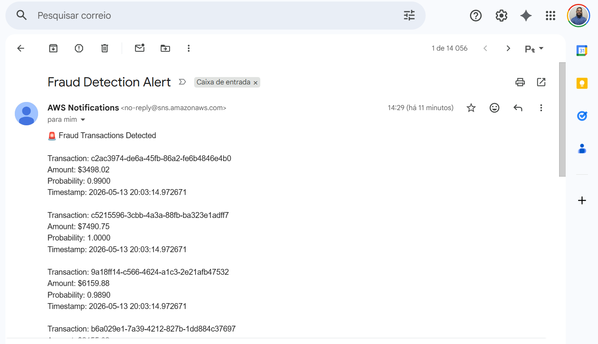

---

## Demo Lambda/SNS

The following demonstration video showcase the automated fraud alerting workflow operating inside AWS.

<video width="100%" controls>
  <source src="03_lamba_sns_notification.mp4" type="video/mp4">
</video>

# Airflow Orchestration

Apache Airflow was used to orchestrate the complete fraud analytics platform and coordinate all major stages of the E2E workflow.

The orchestration layer became one of the most important components of the project because it transformed the platform from a collection of isolated scripts into an automated operational fraud monitoring pipeline.

Instead of manually executing each processing stage independently, Airflow manages the complete workflow lifecycle including:

- Incremental ingestion
- Distributed Spark transformations
- Feature engineering
- Fraud inference
- Prediction persistence
- Automated fraud alerting

---

## End-to-End Workflow

```{mermaid}
graph LR

A[Airbyte Incremental Sync]
--> B[Bronze to Silver]

B --> C[Silver to Gold]

C --> D[Fraud Inference]

D --> E[Write Predictions to RDS]

E --> F[Trigger Fraud Alert Lambda]
```

---

The DAG was intentionally designed using sequential dependency chaining to guarantee deterministic execution behavior.

Each task only starts after the successful completion of the previous stage, ensuring that:

- Incremental ingestion is completed before Spark transformations
- Feature engineering is completed before inference
- Predictions are persisted before alert triggering
- Fraud monitoring only occurs after new predictions become available

This orchestration model improves operational consistency while also supporting replay-safe pipeline behavior.

---

The Airflow environment itself was deployed using Docker containers, enabling reproducibility and isolated execution across all orchestration services.

The infrastructure includes:

| Service | Responsibility |
|---|---|
| Airflow Webserver | DAG visualization and monitoring |
| Airflow Scheduler | Workflow execution management |
| Airflow Init | Initial environment setup |

---

One of the most interesting aspects of the orchestration layer is the integration between Airflow and AWS Lambda.

After the prediction persistence stage is completed, Airflow automatically invokes the fraud monitoring Lambda function. The Lambda service then queries Amazon RDS, identifies high-risk fraud transactions, and dispatches alert notifications through Amazon SNS.

This creates a complete event-driven fraud monitoring workflow fully integrated into the orchestration layer.

Several end-to-end executions were performed to validate the stability of the orchestration pipeline.

---

## Airflow DAG

The Airflow DAG coordinates the complete fraud analytics workflow including:

- Spark transformations
- Incremental inference
- RDS persistence
- AWS Lambda invocation
- Fraud monitoring automation

---

### DAG — fraud_detection_pipeline.py

<details>
<summary><strong>See DAG Code</strong></summary>

```python
from airflow import DAG
from airflow.providers.docker.operators.docker import DockerOperator
from airflow.operators.bash import BashOperator

from docker.types import Mount

from datetime import datetime


# ============================================================
# LOCAL SPARK PROJECT PATH
# ============================================================

SPARK_PROJECT_PATH = (
    "C:/Users/br_vicgab/Desktop/Gabriel/"
    "github/fraud-detection-platform/"
    "de-ml-fraud-detection/spark"
)


# ============================================================
# DOCKER IMAGE
# ============================================================

SPARK_IMAGE = "de-ml-fraud-detection-pyspark"


# ============================================================
# DAG CONFIGURATION
# ============================================================

default_args = {

    "owner": "Gabriel Ferreira",
    "depends_on_past": False,
    "start_date": datetime(2025, 1, 1),
    "retries": 1

}


# ============================================================
# DAG DEFINITION
# ============================================================

with DAG(

    dag_id="fraud_detection_pipeline",

    default_args=default_args,

    schedule=None,

    catchup=False,

    tags=["fraud", "spark", "ml", "aws"]

) as dag:


    # ========================================================
    # BRONZE TO SILVER
    # ========================================================

    bronze_to_silver = DockerOperator(

        task_id="bronze_to_silver",

        image=SPARK_IMAGE,

        api_version="auto",

        auto_remove=True,

        docker_url="unix://var/run/docker.sock",

        network_mode="de-ml-fraud-detection_fraud_network",

        command="""
        spark-submit
        --jars /home/jovyan/work/jars/hadoop-aws-3.3.4.jar,/home/jovyan/work/jars/aws-java-sdk-bundle-1.12.262.jar
        /home/jovyan/work/jobs/01_bronze_to_silver.py
        """,

        working_dir="/home/jovyan/work",

        mounts=[
            Mount(
                source=SPARK_PROJECT_PATH,
                target="/home/jovyan/work",
                type="bind"
            )
        ],

        mount_tmp_dir=False

    )


    # ========================================================
    # SILVER TO GOLD
    # ========================================================

    silver_to_gold = DockerOperator(

        task_id="silver_to_gold",

        image=SPARK_IMAGE,

        api_version="auto",

        auto_remove=True,

        docker_url="unix://var/run/docker.sock",

        network_mode="de-ml-fraud-detection_fraud_network",

        command="""
        spark-submit
        --jars /home/jovyan/work/jars/hadoop-aws-3.3.4.jar,/home/jovyan/work/jars/aws-java-sdk-bundle-1.12.262.jar
        /home/jovyan/work/jobs/02_silver_to_gold.py
        """,

        working_dir="/home/jovyan/work",

        mounts=[
            Mount(
                source=SPARK_PROJECT_PATH,
                target="/home/jovyan/work",
                type="bind"
            )
        ],

        mount_tmp_dir=False

    )


    # ========================================================
    # FRAUD INFERENCE
    # ========================================================

    fraud_inference = DockerOperator(

        task_id="fraud_inference",

        image=SPARK_IMAGE,

        api_version="auto",

        auto_remove=True,

        docker_url="unix://var/run/docker.sock",

        network_mode="de-ml-fraud-detection_fraud_network",

        command="""
        spark-submit
        --jars /home/jovyan/work/jars/hadoop-aws-3.3.4.jar,/home/jovyan/work/jars/aws-java-sdk-bundle-1.12.262.jar
        /home/jovyan/work/jobs/03_fraud_inference.py
        """,

        working_dir="/home/jovyan/work",

        mounts=[
            Mount(
                source=SPARK_PROJECT_PATH,
                target="/home/jovyan/work",
                type="bind"
            )
        ],

        mount_tmp_dir=False

    )


    # ========================================================
    # WRITE PREDICTIONS TO RDS
    # ========================================================

    write_predictions_to_rds = DockerOperator(

        task_id="write_predictions_to_rds",

        image=SPARK_IMAGE,

        api_version="auto",

        auto_remove=True,

        docker_url="unix://var/run/docker.sock",

        network_mode="de-ml-fraud-detection_fraud_network",

        command="""
        spark-submit
        --jars /home/jovyan/work/jars/hadoop-aws-3.3.4.jar,/home/jovyan/work/jars/aws-java-sdk-bundle-1.12.262.jar
        /home/jovyan/work/jobs/04_write_predictions_to_rds.py
        """,

        working_dir="/home/jovyan/work",

        mounts=[
            Mount(
                source=SPARK_PROJECT_PATH,
                target="/home/jovyan/work",
                type="bind"
            )
        ],

        mount_tmp_dir=False

    )


    # ========================================================
    # TRIGGER FRAUD ALERT LAMBDA
    # ========================================================

    trigger_fraud_alert = BashOperator(

        task_id="trigger_fraud_alert",

        bash_command="""
        aws lambda invoke \
        --function-name fraud-alert-function \
        --payload '{}' \
        /tmp/fraud_alert_response.json
        """

    )


    # ========================================================
    # TASK FLOW
    # ========================================================

    bronze_to_silver \
    >> silver_to_gold \
    >> fraud_inference \
    >> write_predictions_to_rds \
    >> trigger_fraud_alert
```

</details>

## Demo 

The following demonstration video showcase the complete orchestration workflow running through Apache Airflow.

<video width="100%" controls>
  <source src="04_DAG_execution.mp4" type="video/mp4">
</video>

# Monitoring Dashboard

To improve operational observability and simulate a real fraud analytics monitoring environment, the platform includes an executive monitoring dashboard developed with Streamlit.

The dashboard was designed to provide centralized visibility across fraud predictions, operational metrics, geospatial fraud distribution, and pipeline monitoring indicators.

Instead of limiting the project to backend processing pipelines, this layer introduces a business-facing analytical interface capable of exposing fraud monitoring insights in a more operational and executive-oriented format.

The monitoring layer consumes fraud predictions directly from Amazon RDS, allowing the dashboard to continuously reflect newly generated fraud inference results.

## Monitoring Dashboard

The dashboard includes:

- Fraud KPIs
- Prediction monitoring
- Fraud probability analytics
- Geospatial fraud visualization
- Pipeline execution indicators
- Operational metrics

---

## Dashboard Architecture

```{mermaid}
graph LR

A[Amazon RDS Fraud Predictions]
--> B[Streamlit Dashboard]

B --> C[Fraud Monitoring KPIs]

B --> D[Fraud Distribution Analytics]

B --> E[Geospatial Monitoring]
```


## Operational Monitoring Metrics

The dashboard exposes several operational indicators including:

| Metric | Description |
|---|---|
| Total Predictions | Total scored transactions |
| Fraud Predictions | Fraudulent transaction count |
| Fraud Rate | Fraud percentage |
| Average Fraud Probability | Mean fraud score |
| Last Inference | Latest inference execution |
| Pipeline Monitoring | Operational execution visibility |

---

## Fraud Monitoring Dashboard

The dashboard provides centralized visibility across fraud predictions, geospatial fraud activity, operational KPIs, and inference monitoring indicators.

<br>

### Fraud Monitoring Metrics

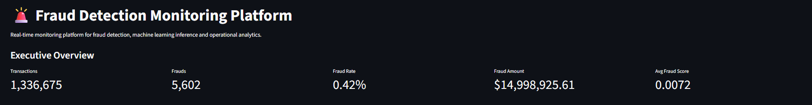

---

### Geospatial Fraud Visualization

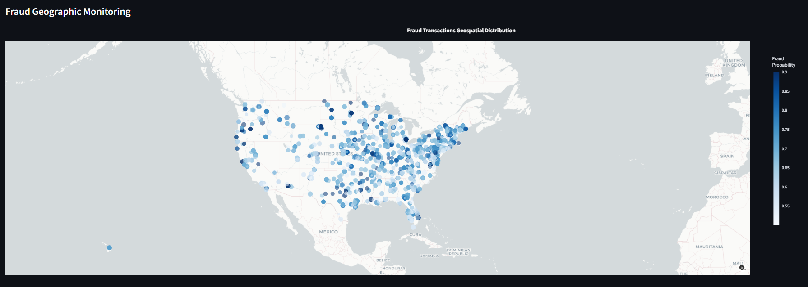

---

### Pipeline Monitoring Section

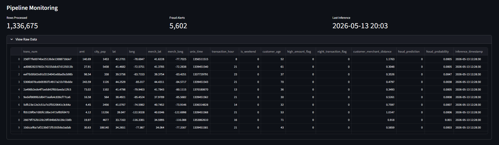

---

## Dashboard Demo Video

The following demonstration video showcases the monitoring dashboard consuming newly generated fraud predictions from Amazon RDS.

<video width="100%" controls muted>
  <source src="05_dashboard_demo.mp4" type="video/mp4">
</video>

---

# Production Characteristics

The objective was not only to demonstrate fraud prediction capabilities, but also to simulate how scalable analytical systems operate across distributed cloud-native infrastructures.

One of the most important characteristics of the platform is the replay-safe architecture implemented throughout the ingestion, inference, and persistence layers. Incremental processing logic ensures that transactions are not duplicated during repeated executions, preserving deterministic pipeline behavior across orchestration cycles.

The platform also leverages distributed processing through Apache Spark, enabling scalable feature engineering and transformation workflows over large transactional datasets. Combined with Amazon S3, this architecture simulates modern cloud-native Data Lake processing patterns frequently used in enterprise analytical systems.

Another important aspect of the project is orchestration and operational automation. Apache Airflow coordinates the complete workflow lifecycle while AWS Lambda and Amazon SNS provide automated fraud monitoring and alerting capabilities integrated directly into the pipeline.

The project also emphasizes modularity and cloud portability. Each stage of the platform was intentionally separated into isolated processing components, improving reproducibility, maintainability, and orchestration flexibility.

Finally, the monitoring layer introduces operational observability through the Streamlit dashboard, enabling fraud analytics visibility, pipeline monitoring, and fraud alert validation through a centralized analytical interface.

---

# Future Improvements

Although the platform already simulates a complete end-to-end fraud analytics environment, several improvements could further evolve the architecture toward a more production-grade real-time fraud monitoring ecosystem.

One of the most important future enhancements would be the introduction of streaming ingestion technologies such as Apache Kafka or Amazon Kinesis. This would allow the platform to process transactions continuously in near real-time instead of relying on controlled batch execution cycles.

The Machine Learning layer could also be expanded with more advanced MLOps capabilities including model versioning, experiment tracking, feature stores, and automated retraining workflows. Integrating tools such as MLflow would improve model governance and lifecycle management across future inference pipelines.

Another important improvement would involve container orchestration and infrastructure scalability. Migrating the processing environment toward Kubernetes-based execution would significantly improve workload distribution, deployment automation, and infrastructure portability.

The monitoring layer could also evolve beyond operational dashboards by incorporating model drift monitoring, anomaly detection, fraud trend analysis, and advanced observability metrics capable of identifying changes in fraud behavior over time.

From a cloud engineering perspective, the platform could be extended with CI/CD pipelines, Infrastructure as Code, automated testing frameworks, and fully managed cloud-native orchestration services to improve deployment reproducibility and operational maturity.

Despite these possible enhancements, the current implementation already demonstrates the core architectural principles behind scalable fraud analytics systems, including distributed processing, incremental ingestion, automated orchestration, operational monitoring, and cloud-native fraud alerting workflows.

# Project Conclusion

This project demonstrates how modern fraud analytics platforms can be designed using cloud services, distributed processing frameworks, incremental ingestion pipelines, and Machine Learning operational workflows.

Rather than focusing exclusively on model development, the platform was intentionally built to simulate the complete lifecycle of a production-oriented fraud monitoring environment, including data ingestion, distributed feature engineering, orchestration, inference, persistence, automated alerting, and operational monitoring.

Throughout the project, technologies such as Apache Spark, Airbyte, Amazon S3, Amazon RDS, AWS Lambda, Amazon SNS, Apache Airflow, and Streamlit were integrated into a unified end-to-end architecture capable of processing large-scale transactional datasets in a scalable and modular way.

The final result is a replay-safe and incrementally orchestrated fraud analytics platform that combines Data Engineering, Machine Learning, cloud infrastructure, and operational monitoring into a single cohesive ecosystem.

More than simply detecting fraudulent transactions, the project demonstrates how modern analytical systems can be operationalized and monitored inside realistic enterprise-style environments.

## GitHub Repository

Access all code, datasets, notebooks, and files for this project:

[Click here to access](https://github.com/FerreiraGabrielw/de-ml-fraud-detection){target="_blank" rel="noopener noreferrer"}

---